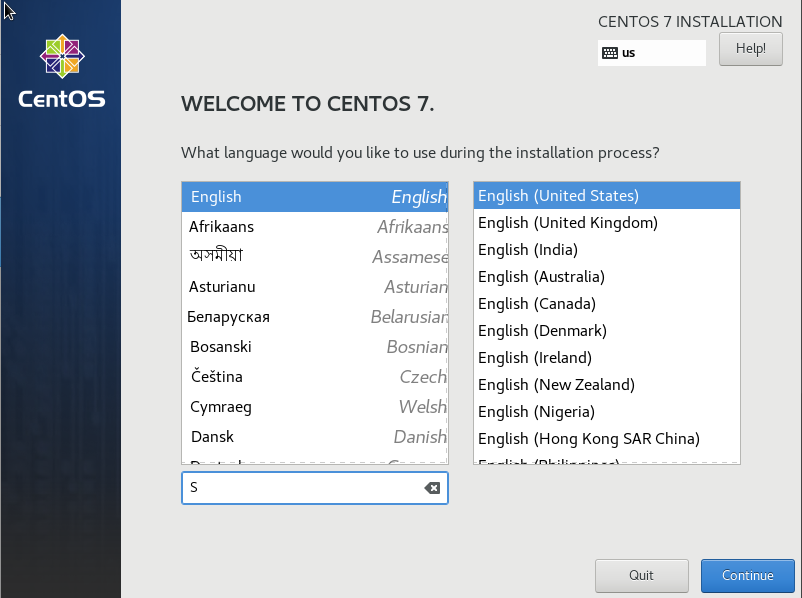
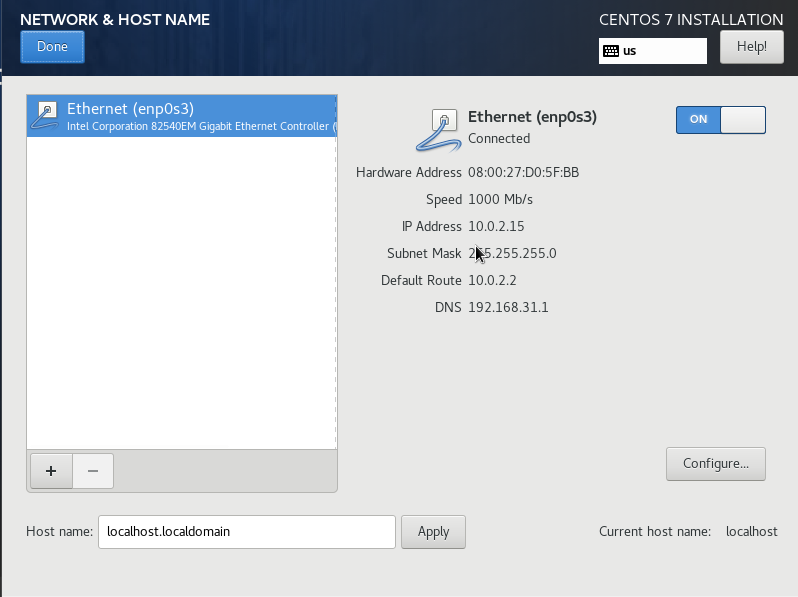
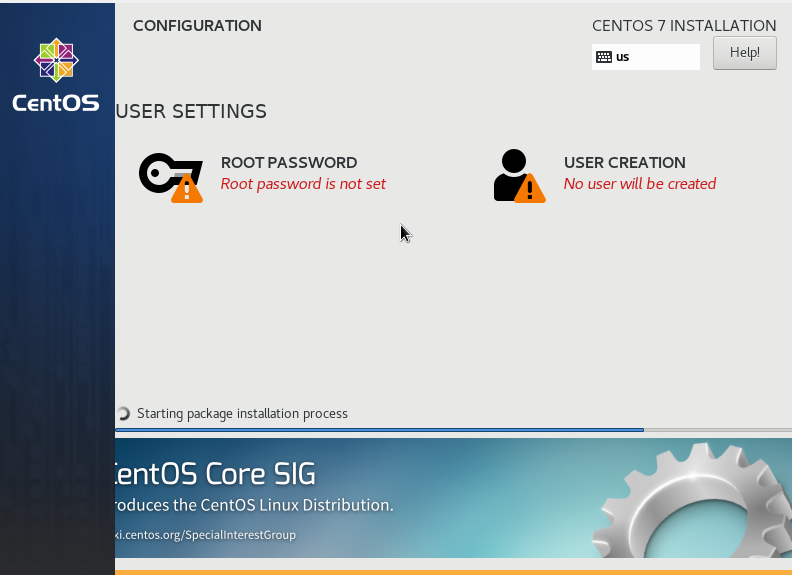
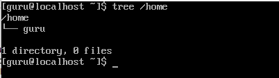
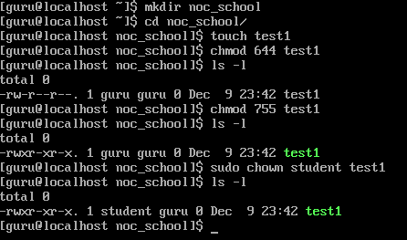

1. Install CentOS 7 on Virtual Machine
2. See tree directory on your system
3. Create dir and file
4. Change permission on file
5. Change owner on file

Step 1
- download [CentOS 7.9](https://www.centos.org/download/)
- download [VirtualBox](https://www.virtualbox.org/wiki/Downloads) and install
- install CentOS 7.9
    * choose English

    * start Network

    * add password for root and another user

Step2
- install tree
> sudo yum install tree

- look tree of home directory 

Step 3
- go to home directory of user
> cd ~

- create folder "noc_school"
>mkdir noc_school

- go to the folder "noc_school"
>cd noc_school

- create file "test1"
>touch test1

- look permission of this file
>ls -l

- change permission of this file
>chmod 644 test1
> 
>ls -l
> 
> chmod 755 test1
> 
>ls -l

- change owner of this file (befor was create user "student")
>sudo chown student test1
>
>ls -l

[Back](../README.md)