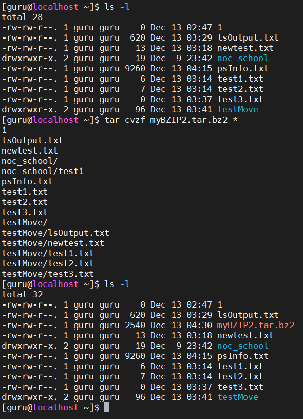

1) Explain what the echo command does.
   From the result of
> echo -e "one\ntwo\tthree"

   explain the purpose of the -e key.

> -e enable interpretation of backslash escapes

2) Execute the sleep 10m and sleep 10s commands each stopped with Ctrl + Z.
   Check the PIDs with jobs. 
   Take the sleep 10s out of the background. 
   Was the time when the process was stopped taken into account? YES
   После этого сделайте текущим десятиминутный слип и прервите его.

3) 
  3.1)Open tty and check that you have a command history.
  3.2)Open the file .bash_history with a text editor, delete its contents, save the file.
  3.3)Do the commands you entered earlier remain in history? YES

4) Create two text files with some date.
   Use the cat program to merge the data from these files into a third file.

5) By default, ls sorts files alphabeticaly.
   Use the linux help system to learn,
   how to sort files by size and time of change.
   And wirte the output to a file.

6) You have files with different extensions in your directory. 
   You need to copy a group of files with the same extension to another directory.
   How do you do this with one command?
   What key should be used, so that when you move it,
   you don't accidentally overwrite a file with the same name that already exists in the directory?

7) Use the Linux help system to find out
   which key to use and how to limit the depth of your search.
   For example, you want to find html files in your home directory.
   You should not search in subfolders.

8) Use the ps utility to output all processes to a file.

9) Bundle files into an archive. Submit the archive to slack.
   Specify which algorithm was used.

* При желании разобраться с утилитой tcpdump
Сделать выгрзку пакетов в вашей сети за 10 минут. Например TCP:80
12) *** Установить gentoo. (По очень большому желанию)